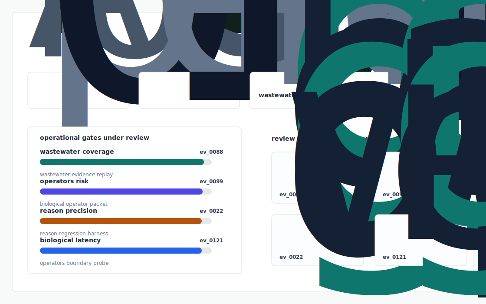
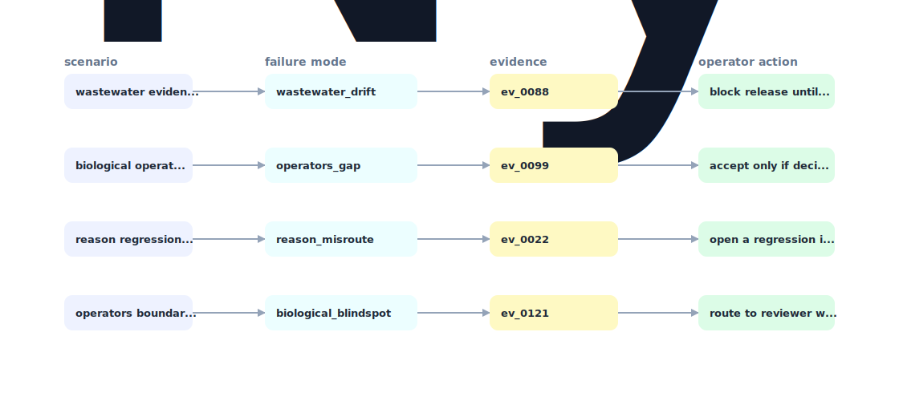

# Bio Ops Shift Copilot

A shift-level wastewater operations copilot that turns synthetic microscopy/process logs into explainable biological state, confidence bands, and operator handoff notes.



## Why it exists

wastewater operators need AI help that can reason over biological process state without pretending sensor-free predictions are certain.

The project is intentionally built as a local replay harness instead of a slide. It creates fixtures, plants realistic failure modes, produces citation-locked evidence, and turns the result into a dashboard a reviewer can inspect without credentials or hosted services.

## What is inside

- Deterministic fixture generation for the company-specific risk surface.
- Strategy code in `src/bio_ops_shift_copilot/strategy.py` with project-specific scoring and visual evidence.
- Citation-locked reports where every decision claim points to a generated evidence ID.
- Two regenerated visual artifacts: `outputs/project_working.svg` and `outputs/evidence_map.svg`.
- A portable demo pack with JSON, CSV, Markdown, HTML, SVG, benchmark, and test artifacts.



## Signals it measures

- `wastewater coverage`
- `operators risk`
- `reason precision`
- `biological latency`

## Failure modes it plants

- wastewater drift
- operators gap
- reason misroute
- biological blindspot

## Run it locally

```bash
uv sync
uv run bio-ops-shift-copilot all
uv run pytest -q
uv run ruff check .
```

## Outputs worth opening

- `outputs/dashboard.html`
- `outputs/project_working.svg`
- `outputs/evidence_map.svg`
- `outputs/operator_brief.md`
- `outputs/decision_report.md`
- `outputs/strategy_model.json`
- `outputs/demo_pack.zip`

## Sources

- https://www.nyad.ai/
- https://www.nyad.ai/about
- https://www.linkedin.com/company/nyad-ai

## Boundary

Everything runs locally against synthetic fixtures. There are no credentials, no customer records, no outreach files, and no hosted API dependency.
